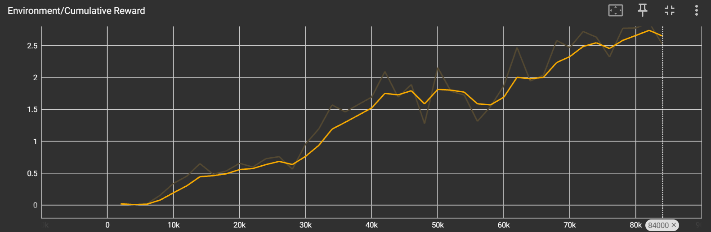

# AI-Powered VR Racing Game Tutorial

### Inleiding

Deze tutorial legt uit hoe je een AI-powered VR project vanaf nul kunt opzetten. Het project draait om een auto zodanig te trainen, door middel van Articifial Intelligence, dat hij in staat wordt om een complexe racebaan af te gaan. Je leert hoe je het project kunt reproduceren, van installatie tot het trainen van de AI-modellen. Aan het einde van deze tutorial kun je:

- Een AI-powered VR project opzetten.
- De benodigde software en versies installeren.
- Het verloop van de simulatie of het spel begrijpen.
- Observaties, acties en beloningen in kaart brengen.
- Objecten en hun gedragingen beschrijven.
- Resultaten van AI-training analyseren met Tensorboard.

### Installatie

Creeër een 3D project, importeer Race car package[^1], Race kart model[^2], Racing Arch[^4] en Quick Outline[^5]. Gebruik vervolgens volgende packages.

| (Package) naam          | Versie      |
| ----------------------- | ----------- |
| Unity versie            | 2022.3.19f1 |
| Python versie           | 3.8         |
| TensorFlow versie       | 2.6.0       |
| ML Agents               | 2.0.1       |
| OpenXR Plugin           | 1.9.1       |
| XR Core Utilities       | 2.3.0       |
| XR Interaction Toolkit  | 2.5.4       |
| XR Legacy Input Helpers | 2.1.10      |
| XR Plugin Management    | 4.4.1       |

Sleep de race kart model en race car in je scene.

### Verloop van de Simulatie

De VR-omgeving bestaat uit een racebaan waarin de raceauto de baan moet afleggen. De ml-agent leert dit zichzelf op basis van acties en beloningen aan. De baan heeft bochten, U-bochten en barrières die hij hoort te ontwijken. Zodra hij de weg heeft afgelegd, stopt de episode.

### Observaties, Acties en Beloningen

- **Observaties:** De sensor ontvangt gegevens over de volgende checkpoint alsook de snelheid, positie van de auto.
- **Acties:** De agent kan 6 discrete acties uitvoeren verdeeld onder twee branches. Voor-, achteruit of niet rijden en links, rechts of niet sturen.
- **Beloningen:** Zodra de training start begint de agent bestraffingen te krijgen (0,1). Dit is zodat de agent weet dat hij hoort te bewegen. Ook krijgt hij straffen van 0.01 wanneer hij achteruit rijdt. Hiermee zijn we zeker dat de agent vooruit rijdt, maar toch willen we de straffing kleiner houden dan niet bewegen, zodat de agent achteruit kan rijden als hij ergens vastzit. Voor het bereiken van een checkpoint krijgt de agent een beloning van 1,0. Eens hij de weg heeft afgelegd, krijgt hij een uiteindelijke beloning van 5,0.

### Beschrijving van de Objecten

- **Race auto (speler)**: Dit is de speler/bestuurder die de racebaan zal voltooien via VR. Hierbij gaat de speler met snelheid door de racebaan en zal hij zo proberen de AI te verslaan.
- **Race auto (Agent)**: Dit is de AI die de racebaan zal voltooien door middel van obstakels te vermijden. Hier gaat de AI zo efficient mogelijk de track voltooien zonder al te veel obstakels te raken. Deze obstakels bestaan uit zowel de barriers als de auto van de speler.
- **Checkpoint**: Er zijn een heleboel checkpoints geplaatst over de racebaan heen. Deze dienen vooral om de agent te leiden naar de juiste kant.
- **Onzichtbare barrières**: Deze barrières die ervoor zorgen dat zowel de speler als de agent op de weg blijven. Zodra de auto in aanraking komt met een barriére, eindigt de episode.

### Informatie van de One-Pager

(wat volgt is een letterlijke overname van de one-pager)

> #### De Logica van de VR Simulatie
>
>In onze project gaat de speler het opnemen tegen een AI. Hierbij gaat de speler, in een VR omgeving, de auto besturen doorheen de racebaan. De speler zorgt er voor dat hij de finish behaalt voor de AI dit doet. >De AI wordt getraind om zo snel mogelijk de finish te behalen en krijgt rewards als hij effectief obstacles vermijd en de finish bereikt voor de speler (human).
>
>#### De Meerwaarde van de AI-component
>
>Om de meerwaarde van een AI component weer te kunnen geven, stellen we ons een racespel voor waarin de computergestuurde auto's geen eigen intelligentie hebben. We kunnen ze programmeren om een vooraf bepaald >pad te volgen. Dit heeft het voordeel dat de auto's altijd de juiste weg afleggen. Hierdoor wordt het spel snel saai, omdat de auto's (AI) voorspelbaar zijn en de speler (human) het pad snel doorheeft, waardoor >het te makkelijk wordt.
>
>Zelfs als we randomisatie toevoegen, blijven de auto's voorspelbaar, omdat ze nog steeds alleen maar het script volgen. Hierdoor lossen we weinig op.
>
>Door de tegenstanders een eigen intelligentie te geven en ze te trainen, kunnen ze steeds verschillende beslissingen nemen op basis van wat ze geleerd hebben. Zo wordt het spel spannender en realistischer en >houden we het spel leuk. Ook houden we ruimte over voor uitbreidingen zoals verschillende moeilijkheidsgraden.
>
> #### Type AI Agent: Adversarial Self-Play
>
>Door dit type agent toe te passen, kunnen we de AI trainen in een dynamische omgeving waarbij de AI zich telkens zelf uitdaagt tegen de speler (human). Dit zorgt ervoor dat de AI telkens beter presteert en >minder gevoelig is aan fouten. Daarnaast ontwikkelt de AI verschillende strategieën om de race zo effectief mogelijk te vervolledigen.
>
>#### Waarom VR?
>
>Er zijn verschillende redenen waarom het interessanter is om dit project uit te voeren in VR. Zo zorgt dit voor meer betrokkenheid van de speler. De speler kan zich meer inleven in het spel en sneller >schattingen maken. Ook voor AI kan dit enorm interessant zijn, want zo leert de AI zichzelf te ontwikkeling in een realistische omgeving. Verder geeft een VR omgeving het gevoel dat de speler daadwerkelijk in >de speelruimte is. Zelfs de uiterste ooghoeken van de speler zullen ingenomen worden door het spel. Al deze factoren helpen mee om het spel _immersive_ te maken.
>
>#### Interactie in de Simulatie
>
>De speler (human) gebruikt een VR-bril met de daarbij horende controllers om het spel te besturen. De controllers maken het mogelijk dat de auto kan rijden, draaien, afremmen en achteruit rijden. De VR-bril zal >het hele zicht van de speler innemen de rol van een traditionele computer- of TV-scherm overnemen.

### Een korte samenvatting

In het VR Racing-project nemen spelers het op tegen een auto die wordt bestuurd door AI in een VR. De speler moet het racebaan de finishlijn bereiken voordat de AI dat doet. De AI wordt getraind om obstakels en barrières te vermijden en zo snel mogelijk de finish te bereiken. De AI krijgt hierbij zijn rewards als dit lukt.

Door de AI te implementeren met behulp van adversarial self-play kan deze continu verbeteren en strategieën ontwikkelen, wat de uitdaging vergroot. VR verhoogt de spelersbetrokkenheid, waardoor de game-ervaring realistischer en interactiever wordt. Door het gebruik van VR worden de spelers volledig ondergedompeld in de VR wereld en kunnen ze zich als echt formula one rijders achten.

### Afwijkingen van de One-Pager

Oorspronkelijk werd er enkel gepland om de agent te trainen door Reinforcement learning. Hierin gaat de agent willekeurige acties uitvoeren en zien welke acties hem een beloning zorgen. Echter door een te complexe racebeen hebben we de hulp van Imitation leaning ingeschakeld. Bij Imitation learning voeren we de acties manueel uit en leren we de agent aan door middel van demonstraties. Verder traint de AI enkel en alleen tegen zichzelf. De AI functioneert in het uiteindelijke spel als een ghost car die door de speler wel zal gezien kunnen worden maar functioneert eigenlijk appart van de speler. Het doel van het spel is om simpelweg sneller dan de AI rond te rijden en niet echt te racen. Verder hebben we ook het gewenste resultaat niet uit onze training zien te krijgen, hierover meer verder in dit document.

## Resultaten

### Resultaten van de training met Tensorboard

- 

### Beschrijving van de Tensorboard Grafieken

De cumulative reward-functie lijkt geleidelijk te stijgen. Dit wil zeggen dat de agent zich op de juiste manier aan het trainen. Hoe langer hij traint, hoe meer hij weet waar de rewards te vinden zijn. We verwachten ook dat de lengte van de episosed geleidelijk dalen. Dit komt omdat de agent sneller en sneller zijn opdracht kan voltooien.

### Opvallende Waarnemingen

We merkten echter ook op dat de agent nooit echt goed genoeg is geworden om de gewenste taak te voltooien (grafiek geeft niet het volledige beeld weer). Buiten een paar uitschieters is de agent nooit goed genoeg geworden om de racetrack snel en goed te voltooien. Om dit probleem op te lossen hebben we een poging gedaan met imitation learning, maar dit is echter ook in het water gevallen. Het standaard getrainde model is het model dat in het spel achter het stuur van de AI auto te vinden is.

## Conclusie

### Samenvatting

De AI werd in het algemeen wel beter, maar de methoden / de omgeving waren te complex voor de AI om correct te leren goed rond een racetrack te rijden.

### Persoonlijke Visie

Een AI leren om rond een racetrack te rijden is zeer complex. Om dit te verwezeljken volstaat het niet om de AI "in het diepe te gooien" en direct over de gehele racetrack te laten rijden.

### Verbeteringen voor de Toekomst

Verbeteringen wouden in het trainingsproces kunnen aangebracht worden bij de volgende punten. In de plaats van de AI over de gehele racetrack te training (veel en moeilijke bochten / stukken) zou het al beter zijn om de Ai eerst te trainen de muur niet te raken op een recht stuk baan. Verder zou het ook al een verbetering zijn om de AI te belonen voor elk stukje progressie naar het einde van de track, niet alleen naar specifieke checkpoints. Zo zou de AI niet meer nodeloos achteruit proberen rijden, aangezien dit direct een negatief resultaat zou opleveren.

# Bronvermelding

[^1]: [Race Car package](https://assetstore.unity.com/packages/3d/vehicles/race-car-package-141690) | 3D Vehicles | Unity Asset Store. (2021, 7 augustus). Unity Asset Store.
[^2]: [Sketchfab.](https://sketchfab.com/3d-models/race-trackkarting-track-based-on-south-garda-32c21042ba144ce9bd2822a88d5b54ec) (z.d.). Race track/Karting Track based on South Garda - Download Free 3D model by Mauro3D (@maurogsw).
[^3]: [Vanmillion Studios.](https://www.youtube.com/watch?v=jr4eb4F9PSQ) (2022, 16 april). Simple car controller in Unity 3D (Part 1- movement) | Easy Unity Tutorial 2022 [Video]. YouTube.
[^4]: [Racing Arch | 3D model.](https://www.cgtrader.com/free-3d-models/car/racing-car/racing-arch) (z.d.). CGTrader.
[^5]: [Quick Outline](https://assetstore.unity.com/packages/tools/particles-effects/quick-outline-115488) (2022, 7 maart). Quick Outline world-space outline tool by Chris Nolet
[^6]: Vanmillion Studios. (2022, 16 april). Simple car controller in Unity 3D (Part 1- movement) | Easy Unity Tutorial 2022 [Video]. YouTube. https://www.youtube.com/watch?v=jr4eb4F9PSQ
